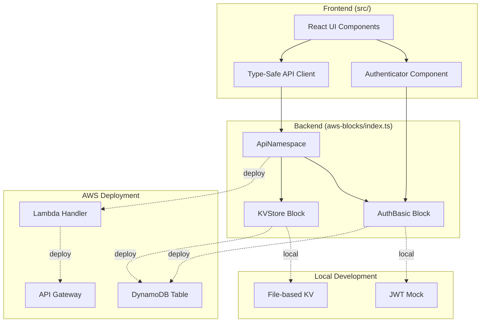
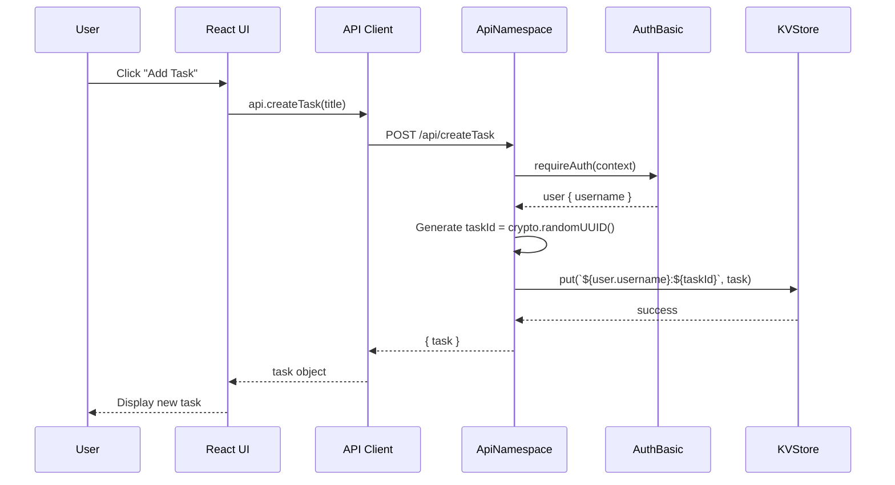

# Design: Student Task Manager

## Overview

The Student Task Manager is a full-stack task management application built with AWS Blocks Building Blocks, React, and TypeScript. The system enables users to create accounts, authenticate, and manage their personal tasks with complete data isolation between users. The application follows a local-first development approach where all features work locally without AWS credentials, then deploy seamlessly to AWS infrastructure.

### Core Architecture Principles

1. **Type-Safe API Layer**: Backend exports are directly imported by frontend with full TypeScript type safety
2. **Building Blocks Abstraction**: AWS Blocks handles HTTP routing, serialization, authentication, and data persistence
3. **User-Scoped Data**: All operations are scoped to authenticated users via key prefixing and server-side verification
4. **Zero-Config Deployment**: Same code runs locally (with mocks) and in AWS (with real services)

### Technology Stack

- **Frontend**: React 18+ with TypeScript, Vite for build tooling, plain CSS
- **Backend**: AWS Blocks ApiNamespace, AuthBasic for authentication, KVStore for data persistence
- **Local Development**: File-based KVStore mock in `.bb-data/`, JWT-based AuthBasic mock
- **AWS Deployment**: Amazon DynamoDB (via KVStore), AWS Lambda (via ApiNamespace), Amazon API Gateway

## Architecture

### System Architecture Diagram



### Request Flow

#### Authentication Flow

1. User opens application
2. Frontend renders `AccountMenuBar` (prebuilt UI component from `@aws-blocks/blocks/ui`)
3. User clicks "Sign In" → `Authenticator` component appears
4. User enters credentials (or creates account)
5. `Authenticator` calls `authApi.signIn()` or `authApi.signUp()`
6. AuthBasic validates credentials, returns JWT token stored in HTTP-only cookie
7. Frontend detects auth state change via `AuthenticatedContent` wrapper
8. Authenticated UI renders with user context

#### Task Operation Flow

1. Frontend calls type-safe API method (e.g., `api.createTask('Buy milk')`)
2. AWS Blocks runtime serializes arguments, sends POST to `/api/<method>`
3. Backend ApiNamespace receives request with `context` parameter
4. API method calls `auth.requireAuth(context)` → extracts user from JWT
5. API method performs KVStore operation with user-scoped key: `${userId}:${taskId}`
6. Response serialized and returned to frontend
7. Frontend updates UI with new data

### Data Flow Diagram



## Components and Interfaces

### Frontend Components

#### App Component (`src/App.tsx`)

**Responsibility**: Root component managing authentication state and task UI

**Structure**:
```tsx
export function App() {
  return (
    <div>
      {/* Account menu bar with sign in/out */}
      <AccountMenuBar api={authApi} />
      
      {/* Conditional rendering based on auth state */}
      <AuthenticatedContent 
        api={authApi}
        authenticatedView={(user) => <TaskManager user={user} />}
        unauthenticatedView={<SignInPrompt />}
      />
    </div>
  );
}
```

**Key Elements**:
- `AccountMenuBar`: Prebuilt component from `@aws-blocks/blocks/ui` - renders user menu and Authenticator modal
- `AuthenticatedContent`: Wrapper that listens to auth state changes and conditionally renders views
- `TaskManager`: Main task management interface (authenticated users only)
- `SignInPrompt`: Simple message prompting users to sign in

#### TaskManager Component

**Responsibility**: Task CRUD operations and list display

**State Management**:
```tsx
const [tasks, setTasks] = useState<Task[]>([]);
const [loading, setLoading] = useState(true);
const [error, setError] = useState<string | null>(null);
const [newTaskTitle, setNewTaskTitle] = useState('');
const [editingTaskId, setEditingTaskId] = useState<string | null>(null);
const [editingTitle, setEditingTitle] = useState('');
```

**Key Methods**:
- `loadTasks()`: Fetch all user tasks via `api.listTasks()`
- `handleCreateTask()`: Create new task with validation
- `handleToggleComplete(taskId)`: Toggle task completion status
- `handleEditStart(task)`: Enter edit mode for a task
- `handleEditSave(taskId)`: Save edited task title
- `handleDelete(taskId)`: Delete a task

**UI Structure**:
```tsx
<div className="task-manager">
  <TaskInput onSubmit={handleCreateTask} />
  {error && <ErrorBanner message={error} />}
  {loading ? <LoadingSpinner /> : (
    tasks.length === 0 ? 
      <EmptyState /> : 
      <TaskList tasks={tasks} onToggle={handleToggleComplete} onEdit={handleEditSave} onDelete={handleDelete} />
  )}
</div>
```

#### TaskInput Component

**Props**:
```tsx
interface TaskInputProps {
  onSubmit: (title: string) => Promise<void>;
}
```

**Behavior**:
- Input field for task title
- Submit on Enter key or button click
- Validates non-empty title
- Clears input after successful submission

#### TaskList Component

**Props**:
```tsx
interface TaskListProps {
  tasks: Task[];
  onToggle: (taskId: string) => Promise<void>;
  onEdit: (taskId: string, newTitle: string) => Promise<void>;
  onDelete: (taskId: string) => Promise<void>;
}
```

**Rendering**:
- Maps over tasks array
- Each task renders as `TaskItem` component
- Applies conditional styling for completed tasks (strikethrough, dimmed)

#### TaskItem Component

**Props**:
```tsx
interface TaskItemProps {
  task: Task;
  onToggle: (taskId: string) => Promise<void>;
  onEdit: (taskId: string, newTitle: string) => Promise<void>;
  onDelete: (taskId: string) => Promise<void>;
}
```

**State**:
```tsx
const [isEditing, setIsEditing] = useState(false);
const [editValue, setEditValue] = useState(task.title);
```

**UI Elements**:
- Checkbox (completion status)
- Title (clickable for edit mode) or input field (when editing)
- Delete button

### Backend API Methods

#### API Namespace Definition

```typescript
export const api = new ApiNamespace(scope, 'api', (context) => ({
  createTask(title: string): Promise<Task>
  listTasks(): Promise<Task[]>
  updateTask(taskId: string, title: string): Promise<Task>
  toggleTask(taskId: string): Promise<Task>
  deleteTask(taskId: string): Promise<void>
}));
```

#### Method: `createTask(title: string)`

**Authorization**: Requires authentication via `auth.requireAuth(context)`

**Process**:
1. Extract user from context: `const user = await auth.requireAuth(context);`
2. Validate title is non-empty (throw error if empty)
3. Generate unique task ID: `const taskId = crypto.randomUUID();`
4. Create task object:
```typescript
const task: Task = {
  id: taskId,
  title: title.trim(),
  completed: false,
  createdAt: new Date().toISOString(),
  userId: user.username  // Server-side only, never from client
};
```
5. Store in KVStore with user-scoped key: `await tasks.put(\`${user.username}:${taskId}\`, task);`
6. Return task object

**Error Conditions**:
- `401 Unauthorized`: No valid authentication
- `400 Bad Request`: Empty title

#### Method: `listTasks()`

**Authorization**: Requires authentication

**Process**:
1. Extract user: `const user = await auth.requireAuth(context);`
2. Scan KVStore with user prefix: `const entries = await tasks.scan({ prefix: \`${user.username}:\` });`
3. Extract task values from entries: `const taskList = entries.map(entry => entry.value);`
4. Sort by creation date (oldest first): `taskList.sort((a, b) => new Date(a.createdAt).getTime() - new Date(b.createdAt).getTime());`
5. Return sorted task array

**Key Scoping**: The `prefix` parameter ensures only tasks belonging to the authenticated user are returned

#### Method: `updateTask(taskId: string, title: string)`

**Authorization**: Requires authentication

**Process**:
1. Extract user: `const user = await auth.requireAuth(context);`
2. Validate title is non-empty
3. Fetch existing task: `const key = \`${user.username}:${taskId}\`; const existing = await tasks.get(key);`
4. Verify ownership: `if (!existing || existing.userId !== user.username) throw new Error('Task not found');`
5. Update task: `const updated = { ...existing, title: title.trim() };`
6. Save: `await tasks.put(key, updated);`
7. Return updated task

**Defense-in-Depth**:
- Key is already user-scoped (`${user.username}:${taskId}`)
- Explicit `userId` check ensures no privilege escalation even if key construction has bugs

#### Method: `toggleTask(taskId: string)`

**Authorization**: Requires authentication

**Process**:
1. Extract user: `const user = await auth.requireAuth(context);`
2. Fetch existing task with user-scoped key
3. Verify ownership (same as updateTask)
4. Toggle completion: `const updated = { ...existing, completed: !existing.completed };`
5. Save and return

#### Method: `deleteTask(taskId: string)`

**Authorization**: Requires authentication

**Process**:
1. Extract user: `const user = await auth.requireAuth(context);`
2. Construct user-scoped key: `const key = \`${user.username}:${taskId}\`;`
3. Fetch to verify ownership: `const existing = await tasks.get(key);`
4. Verify: `if (!existing || existing.userId !== user.username) throw new Error('Task not found');`
5. Delete: `await tasks.delete(key);`
6. Return void (or success indicator)

### Backend Building Blocks

#### Scope

```typescript
const scope = new Scope('student-task-manager');
```

The Scope groups all Building Blocks together and provides the namespace for AWS resources.

#### AuthBasic

```typescript
const auth = new AuthBasic(scope, 'auth', {
  passwordPolicy: { 
    minLength: 8,
    requireDigits: false,
    requireLowercase: false,
    requireUppercase: false,
    requireSymbols: false
  },
  sessionDuration: 86400,  // 24 hours in seconds
});

export const authApi = auth.createApi();
```

**Configuration**:
- Minimum password length: 8 characters
- Session duration: 24 hours
- No complex password requirements (digits, symbols, etc.)

**Exported API**:
- `authApi.signUp(username, password)`: Create new account
- `authApi.signIn(username, password)`: Authenticate user
- `authApi.signOut()`: End session
- `authApi.getUser()`: Get current user info

**User Object Structure**:
```typescript
interface AuthUser {
  username: string;  // Unique identifier
  // Other fields managed internally by AuthBasic
}
```

#### KVStore

```typescript
const tasks = new KVStore(scope, 'tasks', {});
```

**Key Format**: `${userId}:${taskId}`

**Example Keys**:
- `alice:550e8400-e29b-41d4-a716-446655440000`
- `bob:7c9e6679-7425-40de-944b-e07fc1f90ae7`

**Operations**:
- `tasks.put(key, value)`: Create or update task
- `tasks.get(key)`: Retrieve task by exact key
- `tasks.scan({ prefix })`: List all tasks with matching prefix
- `tasks.delete(key)`: Remove task

**Local Implementation**: JSON files in `.bb-data/student-task-manager-tasks/`

**AWS Implementation**: Amazon DynamoDB table with String partition key

## Data Models

### Task Type

```typescript
type Task = {
  id: string;         // UUID v4 generated by crypto.randomUUID()
  title: string;      // User-provided task description (1-500 chars)
  completed: boolean; // Completion status (default: false)
  createdAt: string;  // ISO 8601 timestamp: new Date().toISOString()
  userId: string;     // Owner identifier from auth.requireAuth()
};
```

**Example**:
```json
{
  "id": "550e8400-e29b-41d4-a716-446655440000",
  "title": "Complete project documentation",
  "completed": false,
  "createdAt": "2024-01-15T14:30:00.000Z",
  "userId": "alice"
}
```

### KVStore Key-Value Mapping

**Key**: `${userId}:${taskId}` (String)
**Value**: `Task` object (JSON serialized)

**Example Storage**:
```
Key: "alice:550e8400-e29b-41d4-a716-446655440000"
Value: {
  "id": "550e8400-e29b-41d4-a716-446655440000",
  "title": "Complete project documentation",
  "completed": false,
  "createdAt": "2024-01-15T14:30:00.000Z",
  "userId": "alice"
}
```

### User Identity

AuthBasic manages user accounts internally. The application only uses the `username` field returned by `auth.requireAuth(context)`.

```typescript
interface AuthUser {
  username: string;  // Used as userId in task keys
}
```

**Note**: The exact field name must be verified after scaffolding. It could be `user.username`, `user.userId`, or `user.id`. The design assumes `username` based on typical AuthBasic implementations.

## Authentication and Authorization

### Authentication Flow

#### Sign-Up Process

1. User opens app, sees `AccountMenuBar`
2. User clicks "Sign In" → Authenticator modal opens
3. User switches to "Sign Up" tab
4. User enters username and password (8+ characters)
5. Frontend calls `authApi.signUp(username, password)`
6. AuthBasic validates:
   - Username is unique
   - Password meets policy (8+ chars)
7. Account created, JWT token issued in HTTP-only cookie
8. User automatically signed in
9. `AuthenticatedContent` wrapper re-renders with authenticated view

#### Sign-In Process

1. User enters username and password in Authenticator
2. Frontend calls `authApi.signIn(username, password)`
3. AuthBasic validates credentials against stored hash
4. If valid: JWT token issued in cookie
5. If invalid: Error returned to UI
6. UI shows error message or renders authenticated view

#### Session Management

- **Token Storage**: HTTP-only cookie (prevents XSS attacks)
- **Session Duration**: 24 hours (configurable via `sessionDuration`)
- **Token Renewal**: User must re-authenticate after expiration
- **Sign Out**: `authApi.signOut()` clears cookie

### Authorization Strategy

#### Server-Side User Extraction

Every API method starts with:
```typescript
const user = await auth.requireAuth(context);
```

This call:
1. Extracts JWT from request cookie
2. Validates token signature and expiration
3. Returns user object or throws `401 Unauthorized`

**Critical**: User identity is **never** accepted as a parameter from the client. All operations derive the user from the authenticated context.

#### Key Scoping Pattern

All KVStore operations use user-prefixed keys:

**Create**: 
```typescript
const key = `${user.username}:${taskId}`;
await tasks.put(key, task);
```

**List**:
```typescript
const entries = await tasks.scan({ prefix: `${user.username}:` });
```

**Update/Toggle/Delete**:
```typescript
const key = `${user.username}:${taskId}`;
const existing = await tasks.get(key);
if (!existing) throw new Error('Task not found');
// Additional check:
if (existing.userId !== user.username) {
  throw new Error('Unauthorized');
}
```

#### Defense-in-Depth

The system employs multiple layers of security:

1. **Key Prefix Isolation**: Tasks are partitioned by user ID at the storage level
2. **Explicit Ownership Verification**: Each mutation checks `existing.userId === user.username`
3. **Server-Side Identity**: User ID derived from JWT, never trusted from client
4. **HTTP-Only Cookies**: JWT not accessible to JavaScript (XSS protection)

**Why Both Key Scoping and Ownership Checks?**

- Key scoping prevents accidental cross-user access (prevents honest mistakes)
- Ownership verification prevents malicious attempts to manipulate task IDs
- Combined approach ensures security even if one mechanism fails

### User Isolation Verification

**Scenario**: Alice creates tasks, Bob creates tasks in separate sessions

**Alice's Tasks**:
- Keys: `alice:uuid1`, `alice:uuid2`
- Retrieved via: `tasks.scan({ prefix: 'alice:' })`

**Bob's Tasks**:
- Keys: `bob:uuid3`, `bob:uuid4`
- Retrieved via: `tasks.scan({ prefix: 'bob:' })`

**Attack Scenario**: Bob tries to access Alice's task
```typescript
// Bob's session
await api.updateTask('uuid1', 'Hacked');
```

**Backend Handling**:
```typescript
const user = await auth.requireAuth(context);  // Returns { username: 'bob' }
const key = `${user.username}:uuid1`;          // Constructs 'bob:uuid1'
const existing = await tasks.get(key);         // Returns null (doesn't exist)
if (!existing) throw new Error('Task not found');  // Throws error
```

Even if Bob somehow constructs a request with `alice:uuid1`, the ownership check fails:
```typescript
// Hypothetical: Bob bypasses key construction
const existing = await tasks.get('alice:uuid1');  // Gets Alice's task
if (existing.userId !== user.username) {  // 'alice' !== 'bob'
  throw new Error('Unauthorized');  // Blocked
}
```

## Error Handling

### Frontend Error Handling

#### Error State Management

```tsx
const [error, setError] = useState<string | null>(null);

const handleApiCall = async (operation: () => Promise<void>) => {
  try {
    setError(null);
    await operation();
  } catch (err) {
    if (err instanceof Error) {
      setError(err.message);
    } else {
      setError('An unexpected error occurred');
    }
  }
};
```

#### Error Display

**Error Banner Component**:
```tsx
function ErrorBanner({ message, onDismiss }: { message: string; onDismiss: () => void }) {
  return (
    <div className="error-banner">
      <span>{message}</span>
      <button onClick={onDismiss}>×</button>
    </div>
  );
}
```

**CSS Styling**:
```css
.error-banner {
  background-color: #fee;
  color: #c33;
  padding: 12px;
  margin-bottom: 16px;
  border-radius: 4px;
  display: flex;
  justify-content: space-between;
  align-items: center;
}
```

#### Error Recovery

**Task List Resilience**:
- If task load fails, display error but keep previous tasks visible
- Retry button allows user to re-attempt operation
- Don't blank out the entire UI on error

**Optimistic UI Pattern** (optional enhancement):
- Update UI immediately for responsive feel
- Roll back on error
- Show inline error message near failed operation

### Backend Error Handling

#### Authentication Errors

```typescript
try {
  const user = await auth.requireAuth(context);
} catch (err) {
  // AWS Blocks automatically returns 401 Unauthorized
  throw err;
}
```

**Error Codes**:
- `401 Unauthorized`: Missing or invalid JWT token
- `403 Forbidden`: Valid token but insufficient permissions (not used in this app)

#### Validation Errors

```typescript
async createTask(title: string) {
  const user = await auth.requireAuth(context);
  
  if (!title || title.trim().length === 0) {
    throw new Error('Task title cannot be empty');
  }
  
  if (title.length > 500) {
    throw new Error('Task title must be 500 characters or less');
  }
  
  // ... proceed with creation
}
```

**HTTP Status**: AWS Blocks converts thrown errors to 400 Bad Request with error message

#### Ownership Errors

```typescript
async updateTask(taskId: string, title: string) {
  const user = await auth.requireAuth(context);
  const key = `${user.username}:${taskId}`;
  const existing = await tasks.get(key);
  
  if (!existing) {
    throw new Error('Task not found');
  }
  
  if (existing.userId !== user.username) {
    throw new Error('Unauthorized: You do not own this task');
  }
  
  // ... proceed with update
}
```

**HTTP Status**: 400 (could be enhanced to 403/404 with custom error classes)

#### Storage Errors

```typescript
try {
  await tasks.put(key, task);
} catch (err) {
  console.error('KVStore operation failed:', err);
  throw new Error('Failed to save task. Please try again.');
}
```

AWS Blocks handles network errors, serialization failures, and DynamoDB throttling automatically with retries.

### Error User Experience

| Error Scenario | User Experience |
|----------------|-----------------|
| Network offline | "Failed to load tasks. Check your connection." with Retry button |
| Authentication expired | Automatic redirect to sign-in via `AuthenticatedContent` |
| Task not found | "Task not found. It may have been deleted." |
| Empty title validation | "Task title cannot be empty" (inline, near input) |
| Duplicate username on sign-up | "Username already taken" (displayed by Authenticator component) |
| Wrong password on sign-in | "Invalid username or password" (displayed by Authenticator) |
| Server error (500) | "Something went wrong. Please try again later." |

### Logging and Debugging

**Local Development**:
- Errors logged to browser console (frontend)
- Errors logged to terminal (backend via `tsx watch`)

**AWS Deployment** (not required for MVP, but automatically available):
- API Gateway logs in CloudWatch
- Lambda execution logs in CloudWatch
- DynamoDB throttling metrics in CloudWatch

## Testing Strategy

### Unit Testing

**Test Framework**: Vitest (included with Vite)

**Frontend Unit Tests**:
- `TaskInput.test.tsx`: Validates empty title rejection, Enter key submission
- `TaskItem.test.tsx`: Checkbox toggle, edit mode transitions
- `TaskList.test.tsx`: Renders correct number of tasks, handles empty state

**Backend Unit Tests**:
- `api.createTask.test.ts`: Validates task creation with proper user scoping
- `api.listTasks.test.ts`: Verifies only user's tasks are returned
- `api.updateTask.test.ts`: Tests ownership verification logic
- `api.toggleTask.test.ts`: Confirms completion status toggle
- `api.deleteTask.test.ts`: Ensures proper deletion and ownership checks

**Example Backend Test**:
```typescript
import { describe, it, expect, beforeEach } from 'vitest';
import { api, authApi } from '../aws-blocks';

describe('Task API', () => {
  beforeEach(async () => {
    // Clear local .bb-data storage
    // Create test user
  });
  
  it('should create task with user-scoped key', async () => {
    // Sign in as test user
    const context = await authApi.signIn('testuser', 'password123');
    
    // Create task
    const task = await api.createTask('Test task');
    
    // Verify task properties
    expect(task.userId).toBe('testuser');
    expect(task.title).toBe('Test task');
    expect(task.completed).toBe(false);
  });
  
  it('should prevent cross-user task access', async () => {
    // Create task as user1
    const context1 = await authApi.signIn('user1', 'password123');
    const task = await api.createTask('User1 task');
    
    // Sign in as user2
    const context2 = await authApi.signIn('user2', 'password123');
    
    // Attempt to update user1's task
    await expect(
      api.updateTask(task.id, 'Hacked')
    ).rejects.toThrow('Task not found');
  });
});
```

### Integration Testing

**Test Scenarios**:

1. **Multi-User Isolation** (from requirements):
   - Sign up as "alice", create 2 tasks
   - Sign out, sign up as "bob", create 2 tasks
   - Verify bob only sees his tasks
   - Sign out bob, sign in as alice
   - Verify alice still sees her original 2 tasks

2. **Full CRUD Workflow** (from requirements):
   - Sign in, create task "Test task"
   - Verify task appears with checkbox unchecked
   - Toggle completion, verify strikethrough styling
   - Edit title to "Updated task", verify change
   - Delete task, verify removal

3. **Empty and Error States** (from requirements):
   - Sign in as new user, verify empty state message
   - Add task, verify empty state disappears
   - Simulate network error (disconnect or mock API failure)
   - Attempt to add task, verify error message appears
   - Verify existing task remains visible

**Implementation**:
```typescript
// test/integration.test.ts
import { describe, it, expect } from 'vitest';
import { chromium } from 'playwright';

describe('Integration Tests', () => {
  it('Multi-User Isolation', async () => {
    const browser = await chromium.launch();
    const page = await browser.newPage();
    
    await page.goto('http://localhost:3000');
    
    // Sign up as alice
    await page.click('text=Sign In');
    await page.fill('input[name=username]', 'alice');
    await page.fill('input[name=password]', 'password123');
    await page.click('text=Sign Up');
    
    // Create tasks
    await page.fill('input[placeholder*="task"]', 'Buy groceries');
    await page.press('input[placeholder*="task"]', 'Enter');
    await page.fill('input[placeholder*="task"]', 'Walk dog');
    await page.press('input[placeholder*="task"]', 'Enter');
    
    // Verify 2 tasks visible
    expect(await page.locator('.task-item').count()).toBe(2);
    
    // Sign out
    await page.click('text=Sign Out');
    
    // Sign up as bob
    await page.click('text=Sign In');
    await page.fill('input[name=username]', 'bob');
    await page.fill('input[name=password]', 'password123');
    await page.click('text=Sign Up');
    
    // Verify 0 tasks (empty state)
    expect(await page.textContent('body')).toContain('No tasks yet');
    
    await browser.close();
  });
});
```

### End-to-End Testing

**Test File**: `test/e2e.test.ts` (already exists in project)

**Enhanced E2E Tests**:
- User registration and sign-in flow
- Task creation with various inputs (short, long, special characters)
- Task list display and sorting
- Task completion toggle with visual verification
- Task editing (inline edit mode)
- Task deletion with list update
- Error handling (invalid credentials, network failures)
- Multi-tab scenario (same user in two tabs)
- Mobile viewport testing (375px width)

### Manual Testing Checklist

**Local Development**:
- [ ] Run `npm run dev`, verify app loads at `http://localhost:3000`
- [ ] Sign up with new username, verify account creation
- [ ] Sign in with wrong password, verify error message
- [ ] Create task with empty title, verify validation error
- [ ] Create 5 tasks, verify all appear in list
- [ ] Toggle task completion, verify strikethrough styling
- [ ] Edit task title, verify update appears
- [ ] Delete task, verify removal from list
- [ ] Sign out, verify redirect to sign-in prompt
- [ ] Delete `.bb-data/` folder, verify all data cleared
- [ ] Sign up again, verify fresh start

**Multi-User Testing**:
- [ ] Open two browser windows
- [ ] Sign in as "user1" in window 1, create tasks
- [ ] Sign in as "user2" in window 2, create different tasks
- [ ] Verify each user only sees their own tasks
- [ ] Attempt to guess task IDs cross-user (manual API testing)

**Mobile Testing**:
- [ ] Resize browser to 375px width
- [ ] Verify all UI elements are readable
- [ ] Verify touch targets are large enough
- [ ] Test all interactions (tap checkbox, edit, delete)
- [ ] Verify no horizontal scrolling

**AWS Deployment Testing** (optional, beyond MVP):
- [ ] Run `npm run deploy`
- [ ] Verify CloudFormation stack creation
- [ ] Access deployed URL
- [ ] Verify all functionality works identically
- [ ] Test with multiple users across different devices
- [ ] Run `npm run destroy` to clean up resources

### Test Coverage Goals

- **Backend API Methods**: 100% (all 5 CRUD operations)
- **Authorization Logic**: 100% (user scoping and ownership checks)
- **Frontend Components**: 80%+ (focus on user interactions)
- **Integration Paths**: All critical user journeys

### Testing Anti-Patterns to Avoid

❌ **Don't**: Test AWS Blocks internals (AuthBasic, KVStore implementation)
✅ **Do**: Test your application logic built on top of Blocks

❌ **Don't**: Mock the entire API in frontend tests
✅ **Do**: Test frontend components with real API calls against local dev server

❌ **Don't**: Test only happy paths
✅ **Do**: Test error conditions, edge cases, and security boundaries

❌ **Don't**: Write brittle tests coupled to UI text/styling
✅ **Do**: Use test IDs, ARIA labels, or semantic selectors

## Deployment and Operations

### Local Development

**Start Development Server**:
```bash
npm run dev
```

**What Happens**:
1. `tsx watch aws-blocks/scripts/server.ts` starts
2. Backend Building Blocks initialize with local mocks
3. Vite dev server starts on `http://localhost:3000`
4. Frontend connects to backend via proxy
5. Hot module reload (HMR) enabled for instant feedback

**Local Data Storage**:
- Location: `.bb-data/` directory in project root
- Structure:
  ```
  .bb-data/
  ├── student-task-manager-auth-users/   # User accounts (hashed passwords)
  ├── student-task-manager-auth-codes/   # Verification codes (if used)
  └── student-task-manager-tasks/        # Task KVStore (JSON files)
  ```

**Reset Local State**:
```bash
rm -rf .bb-data/
npm run dev
```

### AWS Deployment

**Prerequisites**:
- AWS CLI installed and configured (`aws configure`)
- AWS CDK bootstrapped in target region (`npx cdk bootstrap`)

**Deploy Command**:
```bash
npm run deploy
```

**Deployment Process**:
1. TypeScript compilation (`tsc`)
2. Vite build (frontend static assets)
3. CDK synthesis (generates CloudFormation template)
4. CDK deploy (provisions AWS resources)
5. Outputs deployment URL

**AWS Resources Created**:
- **API Gateway**: HTTP API for backend endpoints
- **Lambda Function**: Runs backend API code
- **DynamoDB Table**: Stores user accounts (AuthBasic)
- **DynamoDB Table**: Stores tasks (KVStore)
- **CloudFront Distribution** (optional): Hosts frontend static files
- **S3 Bucket** (optional): Frontend assets storage
- **CloudWatch Log Groups**: API logs

**Configuration**:
No manual configuration required. AWS Blocks automatically:
- Creates IAM roles with least-privilege permissions
- Configures CORS for frontend-backend communication
- Sets up CloudWatch logging
- Manages resource naming and tagging

**Destroy Deployment**:
```bash
npm run destroy
```

Removes all AWS resources (data is permanently deleted).

### Environment Variables

**Local Development**: None required

**AWS Deployment**: Automatically managed by AWS Blocks
- Lambda environment variables for DynamoDB table names
- API Gateway base URL injected into frontend

**Custom Configuration** (if needed):
```typescript
// aws-blocks/index.ts
const config = {
  sessionDuration: process.env.SESSION_DURATION ? parseInt(process.env.SESSION_DURATION) : 86400,
};
```

### Monitoring and Observability

**Local Development**:
- Console logs in browser (frontend errors)
- Terminal output from `tsx watch` (backend logs)
- Network tab for API request/response inspection

**AWS Deployment** (automatic, no setup required):
- **CloudWatch Logs**: API request logs, Lambda execution logs
- **API Gateway Metrics**: Request count, latency, error rate
- **DynamoDB Metrics**: Read/write capacity, throttling
- **Lambda Metrics**: Invocation count, duration, errors

**Access Logs**:
```bash
# View Lambda logs
aws logs tail /aws/lambda/student-task-manager-api --follow

# View API Gateway logs
aws logs tail /aws/apigateway/student-task-manager --follow
```

### Scalability Considerations

**Local Development**:
- Single-user, single-threaded
- File-based storage (not optimized for high throughput)
- Suitable for development and testing only

**AWS Deployment**:
- **API Gateway**: Scales automatically to handle thousands of requests per second
- **Lambda**: Concurrent executions scale based on demand (default: 1000 concurrent)
- **DynamoDB**: Provisioned capacity mode (default: 5 RCU/WCU) or on-demand mode
- **KVStore Scalability**: Each user partition (userId prefix) scales independently
- **Estimated Capacity**: Supports 10,000+ users with current architecture

**Cost Optimization**:
- Lambda: Pay per request (first 1M requests/month free)
- DynamoDB: On-demand pricing (pay for actual read/write)
- API Gateway: Pay per million requests
- **Estimated Cost**: <$1/month for <100 active users

### Backup and Recovery

**Local Development**:
- Backup: Copy `.bb-data/` directory
- Restore: Replace `.bb-data/` with backup

**AWS Deployment**:
- **DynamoDB Point-in-Time Recovery**: Enable via CDK config
- **Snapshots**: Manual or automated daily snapshots
- **Cross-Region Replication**: Optional for disaster recovery

### Security Best Practices

**Authentication**:
- Passwords hashed with bcrypt (handled by AuthBasic)
- JWT tokens in HTTP-only cookies (XSS protection)
- No credentials stored in frontend code or localStorage

**Authorization**:
- All API methods require authentication
- User ID derived from JWT, never from client parameters
- Key scoping + explicit ownership checks (defense-in-depth)

**Data Protection**:
- HTTPS enforced in production (API Gateway)
- DynamoDB encryption at rest (enabled by default)
- No sensitive data logged (passwords, tokens)

**Dependency Security**:
```bash
npm audit
npm audit fix
```

Run regularly to detect and patch vulnerabilities.

### CI/CD Integration (Future Enhancement)

**GitHub Actions Example**:
```yaml
name: Deploy
on:
  push:
    branches: [main]
jobs:
  deploy:
    runs-on: ubuntu-latest
    steps:
      - uses: actions/checkout@v3
      - uses: actions/setup-node@v3
        with:
          node-version: 22
      - run: npm ci
      - run: npm run typecheck
      - run: npm test
      - run: npm run deploy
        env:
          AWS_ACCESS_KEY_ID: ${{ secrets.AWS_ACCESS_KEY_ID }}
          AWS_SECRET_ACCESS_KEY: ${{ secrets.AWS_SECRET_ACCESS_KEY }}
```

## Appendices

### Glossary

- **AWS Blocks**: Framework for building full-stack apps with local-first development and zero-config AWS deployment
- **Building Block**: Reusable cloud abstraction (e.g., KVStore, AuthBasic) with local mock and AWS implementation
- **ApiNamespace**: Backend API definition that exports type-safe methods to frontend
- **Scope**: Grouping of Building Blocks that determines AWS resource namespace
- **Key Scoping**: Pattern of prefixing storage keys with user IDs for data isolation
- **JWT (JSON Web Token)**: Compact, URL-safe means of representing claims between two parties
- **Defense-in-Depth**: Layered security approach with multiple validation checks

### Reference Links

- **AWS Blocks Documentation**: `node_modules/@aws-blocks/blocks/README.md`
- **React Documentation**: https://react.dev/
- **TypeScript Handbook**: https://www.typescriptlang.org/docs/
- **Vite Documentation**: https://vitejs.dev/
- **DynamoDB Key Design**: https://docs.aws.amazon.com/amazondynamodb/latest/developerguide/bp-partition-key-design.html

### Assumptions and Constraints

**Assumptions**:
- Users have unique usernames (enforced by AuthBasic)
- Task IDs are globally unique (crypto.randomUUID() collision probability is negligible)
- Users primarily access from single device (no cross-device sync requirements)
- Task titles are plain text (no rich formatting needed)

**Constraints**:
- Node.js 22+ and npm 10+ required
- Local development requires writable `.bb-data/` directory
- AWS deployment requires AWS account and credentials
- Browser must support ES2022 features
- Maximum task title length: 500 characters
- Session timeout: 24 hours (requires re-authentication)

### Future Enhancements (Out of Scope)

These features are explicitly excluded from the initial implementation but could be added later:

- **Task Categories/Tags**: Organize tasks into groups
- **Task Priorities**: High/medium/low priority levels
- **Due Dates**: Set deadlines for tasks
- **Recurring Tasks**: Tasks that repeat on a schedule
- **Task Sharing**: Collaborate with other users
- **Notifications**: Email/push notifications for due tasks
- **Mobile Apps**: Native iOS/Android applications
- **Offline Support**: Service worker for offline functionality
- **Task Search**: Full-text search across task titles
- **Task History**: Audit log of changes to tasks
- **Bulk Operations**: Select multiple tasks for batch actions
- **Task Templates**: Predefined task lists
- **Analytics Dashboard**: Task completion metrics and trends

### Migration from Existing Implementation

The current implementation uses:
- `DistributedTable` with secondary indexes (`byPriority`, `byTitle`)
- `Realtime` for WebSocket-based live updates
- Optimistic locking with `version` field
- Priority levels (1=high, 2=medium, 3=low)

**Migration Strategy to Requirements-Compliant Design**:

1. **Simplify Data Model**:
   - Remove `priority` field
   - Remove `version` field (no optimistic locking needed)
   - Keep `id`, `title`, `completed`, `createdAt`, `userId`

2. **Replace DistributedTable with KVStore**:
   ```typescript
   // Before
   const todos = new DistributedTable(scope, 'todos', { ... });
   
   // After
   const tasks = new KVStore(scope, 'tasks', {});
   ```

3. **Update API Methods**:
   - Replace `todos.query()` with `tasks.scan({ prefix })`
   - Remove secondary index queries
   - Remove realtime channel logic
   - Simplify error handling (no optimistic locking conflicts)

4. **Update Frontend**:
   - Remove priority dropdown UI
   - Remove sort-by-priority and sort-by-title buttons
   - Remove realtime subscription logic
   - Simplify to basic CRUD operations

5. **Data Migration** (if needed):
   ```typescript
   // Migration script to convert existing tasks
   const oldTasks = await todos.query({ ... });
   for (const task of oldTasks) {
     const newTask = {
       id: task.todoId,
       title: task.title,
       completed: task.completed,
       createdAt: new Date(task.createdAt).toISOString(),
       userId: task.userId
     };
     await tasks.put(`${task.userId}:${task.todoId}`, newTask);
   }
   ```

6. **Testing Migration**:
   - Verify all existing tasks are accessible
   - Confirm user isolation still works
   - Test all CRUD operations
   - Validate no functionality regressions

**Recommendation**: Start fresh with requirements-compliant implementation rather than migrating, since the current code significantly exceeds requirements scope.
